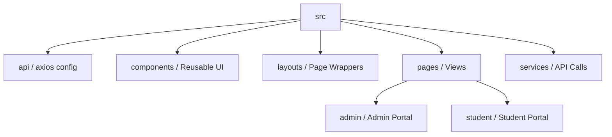

# 🎓 Modern Course Management System (CMS)


> **Empowering Education Through Technology.**
> A state-of-the-art learning platform designed to bridge the gap between instructors and students with a seamless, interactive, and visually stunning user experience.

---

## 📖 Table of Contents
- [✨ Key Features](#-key-features)
  - [For Students](#for-students)
  - [For Administrators](#for-administrators)
- [🛠️ Technology Stack](#-technology-stack)
- [🎨 UI/UX Design Philosophy](#-uiux-design-philosophy)
- [🚀 Getting Started](#-getting-started)
- [📂 Project Architecture](#-project-architecture)
- [🔧 Configuration](#-configuration)
- [🤝 Contributing](#-contributing)

---

## ✨ Key Features

This CMS is engineered with a focus on usability, performance, and scalability. It features a robust Role-Based Access Control (RBAC) system ensuring secure and personalized environments for all users.

### For Students
*   **Intuitive Dashboard**: A gamified landing page featuring progress tracking, achievement stats, and motivational insights.
*   **Interactive Learning**:
    *   **Video Player**: Embedded high-definition video lectures with automatic YouTube integration.
    *   **Resource Center**: One-click download access for supplementary PDF materials and lecture notes.
*   **Course Catalog**: Browse a rich library of courses with advanced filtering and search capabilities.
*   **Enrollment System**: Instant enrollment verification across the platform.

### For Administrators
*   **Centralized Command Center**: A comprehensive dashboard providing real-time metrics on user growth and course performance.
*   **Content Management System (CMS)**:
    *   **Course Creator**: drag-and-drop simplicity for organizing course modules.
    *   **Lecture Manager**: Support for multi-format content (Video URLs, PDF uploads).
*   **User Management**: Full control over student and staff accounts, including manual registration overrides.
*   **Data Integrity**: Secure backend integration ensuring all records are accurate and persistent.

---

## 🛠️ Technology Stack

We utilized the most modern and efficient web technologies to build a lightning-fast, responsive application.

| Component | Technology | Description |
| :--- | :--- | :--- |
| **Frontend Framework** |  | Component-based, declarative UI library. |
| **Build Tool** |  | Next-generation frontend tooling for blazing fast builds. |
| **Styling** |  | Utility-first CSS framework for rapid UI development. |
| **Animations** |  | Production-ready motion library for React. |
| **Icons** |  | Beautiful, consistent, and pixel-perfect icons. |
| **HTTP Client** | **Axios** | Promise-based HTTP client for the browser. |
| **Routing** | **React Router v6** | Declarative routing for single-page applications. |

---

## 🎨 UI/UX Design Philosophy

Our design language prioritizes **Clarity**, **Engagement**, and **Professionalism**.

*   **Glassmorphism**: Subtle translucency and blur effects create a sense of depth and hierarchy.
*   **Modern Typography**: Utilizing clean sans-serif fonts for maximum readability.
*   **Micro-interactions**: Every button click, hover, and page transition is animated to provide tactile feedback to the user.
*   **Responsive Layout**: Flawless experience across Desktop, Tablet, and Mobile devices.

---

## 🚀 Getting Started

Follow these instructions to set up the project locally on your machine.

### Prerequisites
*   Node.js (v16.0.0 or higher)
*   npm (v7.0.0 or higher)

### Installation

1.  **Clone the Repository**
    ```bash
    git clone https://github.com/your-org/cms-frontend.git
    cd cms-frontend
    ```

2.  **Install Dependencies**
    ```bash
    npm install
    # or
    yarn install
    ```

3.  **Environment Setup**
    Create a `.env` file in the root directory (optional, defaults provided):
    ```env
    VITE_API_BASE_URL=http://localhost:5000
    ```

4.  **Launch Development Server**
    ```bash
    npm run dev
    ```
    > The application will start at `http://localhost:5173`

5.  **Build for Production**
    ```bash
    npm run build
    ```

---

## 📂 Project Architecture

The project follows a clean, modular structure designed for scalability.



*   **`components/`**: Atomic design elements (Buttons, Inputs, Cards).
*   **`services/`**: Isolated API logic to keep components clean.
*   **`layouts/`**: Layout patterns ensuring consistent capability (Sidebars, Headers).

---

## 🔧 Configuration

### Customizing the Theme
Tailwind configuration ensures branding consistency. Modify `tailwind.config.js` to update branding colors:

```javascript
export default {
    theme: {
        extend: {
            colors: {
                primary: { ... }, // Your Brand Colors
                secondary: { ... }
            }
        }
    }
}
```

---

## 🤝 Contributing

We welcome contributions to improve this platform!

1.  Fork the Project
2.  Create your Feature Branch (`git checkout -b feature/AmazingFeature`)
3.  Commit your Changes (`git commit -m 'Add some AmazingFeature'`)
4.  Push to the Branch (`git push origin feature/AmazingFeature`)
5.  Open a Pull Request

---

### 📞 Support

For implementation support or feature requests, please contact the development team.

---

*© 2025 CMS Platform. All Rights Reserved.*
